# DIVIDE-CTF-2026

## 📑 Table of Contents

- [Forensics](#forensics)
  - [Can't Let Go](#cant-let-go)
  - [Kelajuan aKa Speed](#kelajuan-aka-speed)
  - [Open Your Eyes](#open-your-eyes)
  - [Something Left Behind](#something-left-behind)
  - [Alien Is Our Friend](#alien-is-our-friend)
  - [AlphaZer0](#alphazer0)
  - [Unusual Incident](#unusual-incident)
  - [Echoes in the Disguise](#echoes-in-the-disguise)
  - [Malware or not?](#malware-or-not)
## Forensics

### Can't Let Go
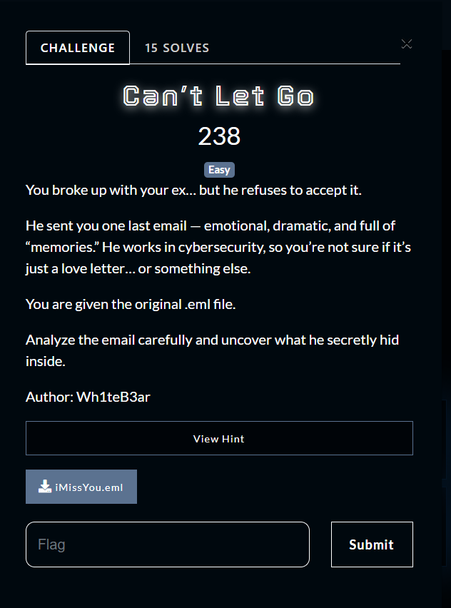

We are given an `.eml` file. The goal is to find the hidden flag inside the attachments sent via email. 

### Step 1: Open the Email
Open the `.eml` file using Outlook. The email contains an attachment named `memories.pdf`.

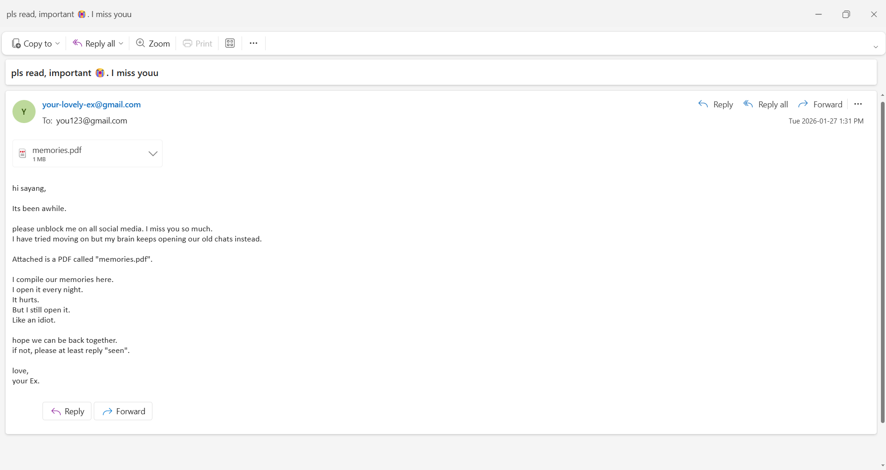

---

### Step 2: Verify the Attachment
Attempting to open `memories.pdf` directly fails. Upon inspection, it turns out that the file is not a true PDF but actually a 7z archive.  

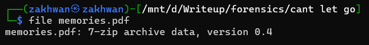

Rename the file extension from `.pdf` to `.7z`:

---

### Step 3: Extract the Archive
Extract `memories.7z`. After extraction, we get a folder named `flag` containing:

1. `letter.txt`
2. `loveYou.txt`
3. `ourPic`
4. `pantai.png`

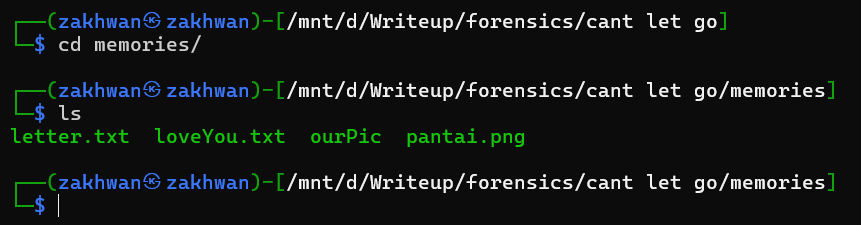

---

### Step 4: Identify Correct File Extensions
Some files have incorrect extensions. After fixing them:

1. `ourPic.png`
2. `loveYou.7z`
3. `letter.png`
4. `pantai.png`

---

### Step 5: Examine Files

### ourPic.png
Opening `ourPic.png` reveals the first part of the flag:

*part1: divide{HoP3_wE_c4N_Be_bACk*

---

### letter.png
`letter.png` contains a password: *theMoonisBeuty*

This password will be used for `loveYou.7z`.

---

### pantai.png
No flag here, just an image for context.

---

### Step 6: Extract loveYou.7z
Use the password `theMoonisBeuty` to extract `loveYou.7z`. Inside, there is a PDF file.

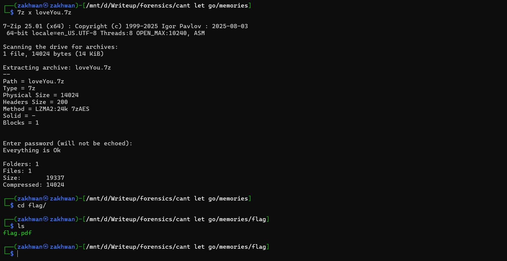

Opening the PDF appears blank, but selecting all text (CTRL + A) reveals the second part of the flag at the bottom:

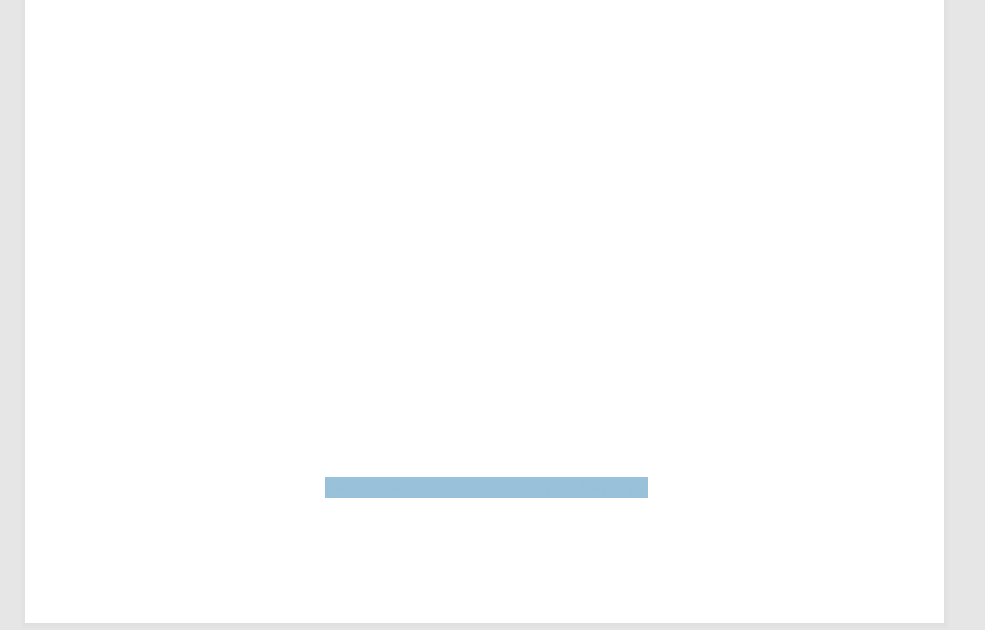

*part2: _AS_B3Fore_i_miss_you_Say4ng}*

#### 🚩 Flag: divide{HoP3_wE_c4N_Be_bACk_AS_B3Fore_i_miss_you_Say4ng}

### Kelajuan aKa Speed

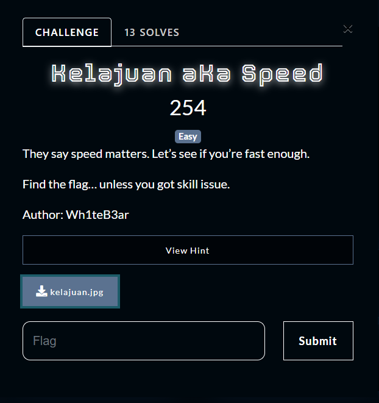

### Challenge Overview
We are given an image containing binary strings hidden across it. The goal is to extract the hidden flag.  

---

### Step 3: Extract Hidden File
Use `steghide` to extract the hidden file from the image using the password `1sh0wspeEd`:

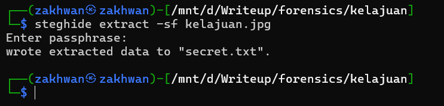

The extraction produces a file named `secret.txt`.

i cat `secret.txt` file and get the flag.

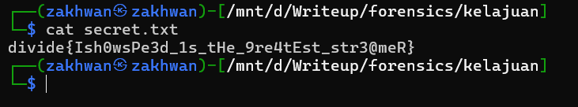

#### 🚩 Flag: divide{Ish0wsPe3d_1s_tHe_9re4tEst_str3@meR}

### Open Your Eyes
### Challenge Overview
We are given two files: `file.pdf` and `Flag.7z`.  
The goal is to find the password hidden in the PDF to extract the 7z archive and retrieve the flag.  

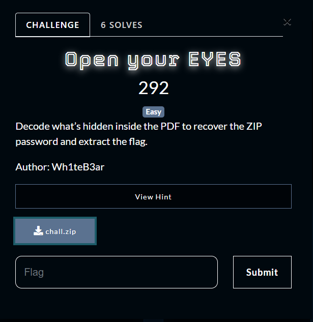

---

### Step 1: Inspect the PDF
Opening `file.pdf` shows a picture of Plankton and some clues, including text like "Tuut Tut".  

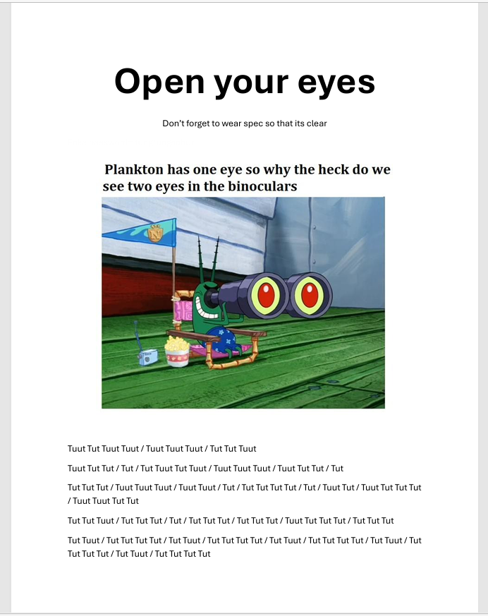

Decoding the text directly yields nothing.  

---

### Step 2: Check for Embedded Files
Use `binwalk` to check for any hidden or appended files:

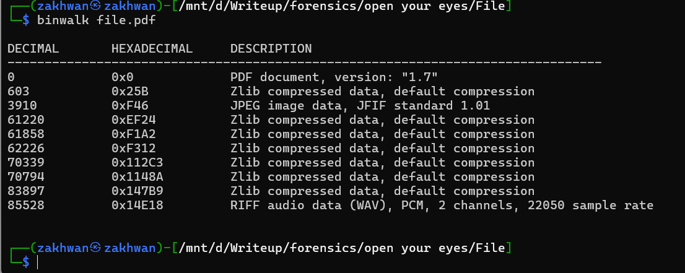

There is a `.wav` file appended at the end of the PDF.

---

### Step 3: Extract the Audio
Extract the embedded WAV file manually:

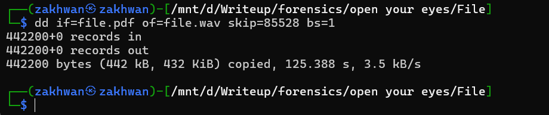

---

### Step 4: Analyze the Audio
Listening to the WAV file suggests it contains a hidden message using sound patterns.  
Open the file in **Audacity** and view it in *spectrogram* mode.  

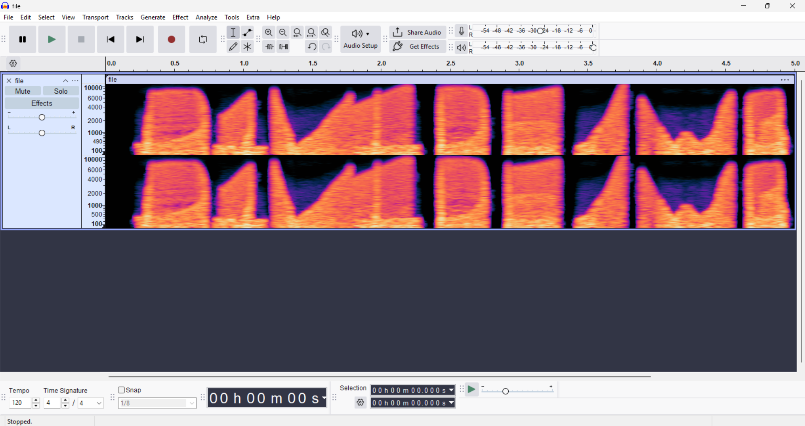

Readable strings appear in the spectrogram. These strings reveal the password for `Flag.7z`:

password: `D1VIDE/WB`

---

### Step 5: Extract the 7z Archive
Use the password to extract `Flag.7z`. The extraction produces `flag.png`.  

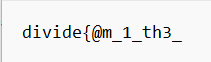

The first part of the flag is:

part1: `divide{@m_1_th3_`

---

## Step 6: Retrieve the Second Part
Use the `strings` command or similar method on `flag.png` to retrieve the second part of the flag:

Part2: `0nlY_@Ne_W4it1ng?}`

#### 🚩 Flag: divide{@m_1_th3_0nlY_@Ne_W4it1ng?}

### Something Left Behind
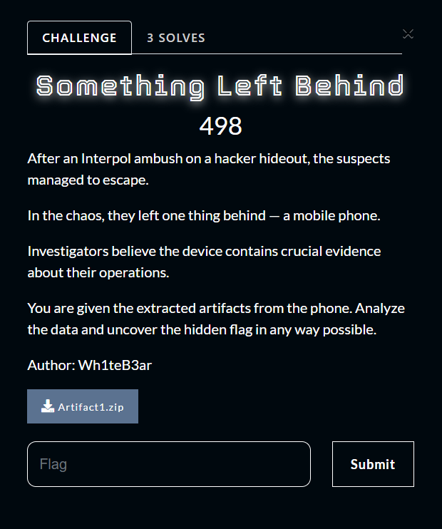
### Alien Is Our Friend
### AlphaZer0
### Unusual Incident
### Echoes in the Disguise
### Malware or not?
