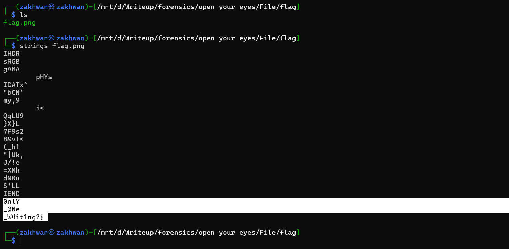
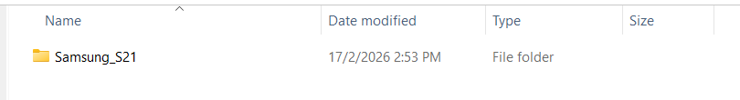
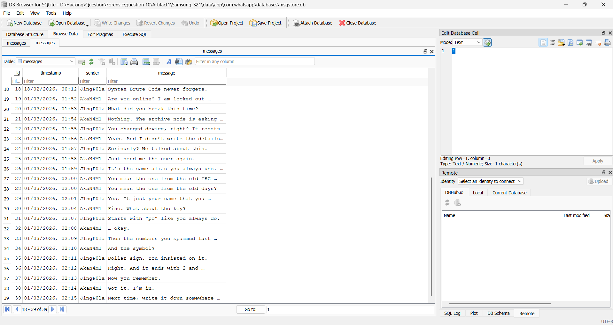
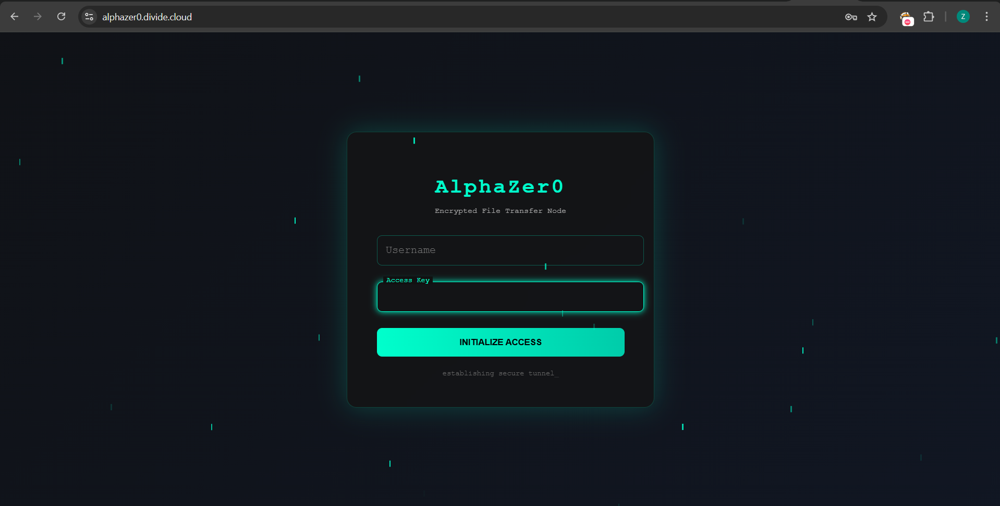
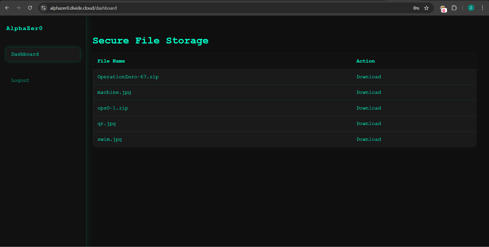
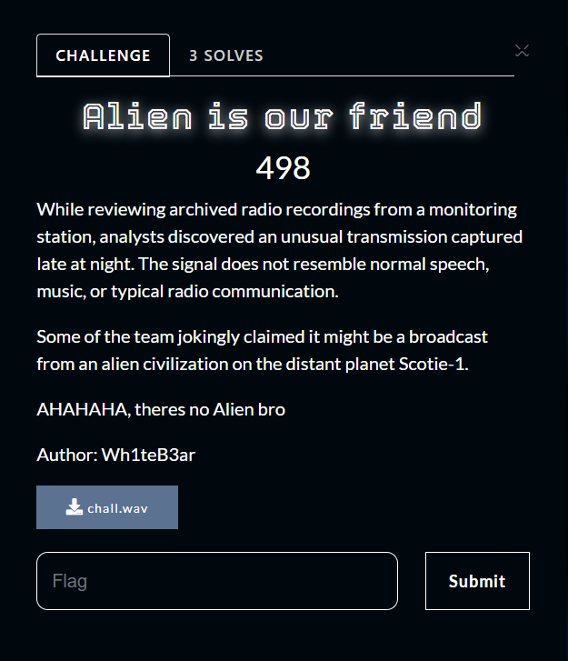
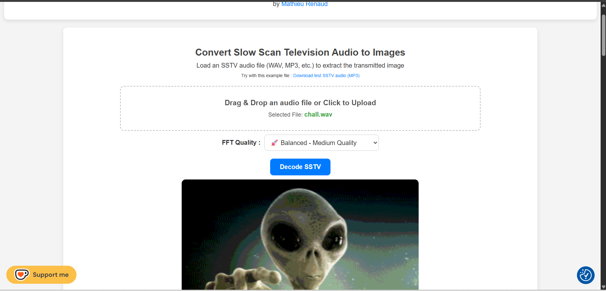

# DIVIDE-CTF-2026

## 📑 Table of Contents

- [Forensics](#forensics)
  - [Can't Let Go](#cant-let-go)
  - [Kelajuan aKa Speed](#kelajuan-aka-speed)
  - [Open Your Eyes](#open-your-eyes)
  - [Something Left Behind](#something-left-behind)
  - [Alien Is Our Friend](#alien-is-our-friend)
  - [AlphaZer0](#alphazer0)
  - [Unusual Incident](#unusual-incident)
  - [Echoes in the Disguise](#echoes-in-the-disguise)
  - [Malware or not?](#malware-or-not)
# Forensics

# Can't Let Go

We are given an `.eml` file. The goal is to find the hidden flag inside the attachments sent via email. 

## Step 1: Open the Email
Open the `.eml` file using Outlook. The email contains an attachment named `memories.pdf`.

---

## Step 2: Verify the Attachment
Attempting to open `memories.pdf` directly fails. Upon inspection, it turns out that the file is not a true PDF but actually a 7z archive.  

Rename the file extension from `.pdf` to `.7z`:

---

## Step 3: Extract the Archive
Extract `memories.7z`. After extraction, we get a folder named `flag` containing:

1. `letter.txt`
2. `loveYou.txt`
3. `ourPic`
4. `pantai.png`

---

## Step 4: Identify Correct File Extensions
Some files have incorrect extensions. After fixing them:

1. `ourPic.png`
2. `loveYou.7z`
3. `letter.png`
4. `pantai.png`

---

## Step 5: Examine Files

### ourPic.png
Opening `ourPic.png` reveals the first part of the flag:

*part1: divide{HoP3_wE_c4N_Be_bACk*

---

## letter.png
`letter.png` contains a password: *theMoonisBeuty*

This password will be used for `loveYou.7z`.

---

## pantai.png
No flag here, just an image for context.

---

## Step 6: Extract loveYou.7z
Use the password `theMoonisBeuty` to extract `loveYou.7z`. Inside, there is a PDF file.

Opening the PDF appears blank, but selecting all text (CTRL + A) reveals the second part of the flag at the bottom:

*part2: _AS_B3Fore_i_miss_you_Say4ng}*

#### 🚩 Flag: divide{HoP3_wE_c4N_Be_bACk_AS_B3Fore_i_miss_you_Say4ng}

---
---

# Kelajuan aKa Speed

## Challenge Overview
We are given an image containing binary strings hidden across it. The goal is to extract the hidden flag.  

---

## Step 1: Extract Binary Strings
The image contains the following binary strings:

`00110001 01110011 01101000 00110000 01110111 01110011 01110000 01100101 01000101 01100100`

---

## Step 2: Decode Binary
Using CyberChef, decode the binary string: `1sh0wspeEd`

---

## Step 3: Extract Hidden File
Use `steghide` to extract the hidden file from the image using the password `1sh0wspeEd`:

The extraction produces a file named `secret.txt`.

i cat `secret.txt` file and get the flag.

#### 🚩 Flag: divide{Ish0wsPe3d_1s_tHe_9re4tEst_str3@meR}

---
---

# Open Your Eyes

## Challenge Overview
We are given two files: `file.pdf` and `Flag.7z`.  
The goal is to find the password hidden in the PDF to extract the 7z archive and retrieve the flag.  

---

## Step 1: Inspect the PDF
Opening `file.pdf` shows a picture of Plankton and some clues, including text like "Tuut Tut".  

Decoding the text directly yields nothing.  

---

## Step 2: Check for Embedded Files
Use `binwalk` to check for any hidden or appended files:

There is a `.wav` file appended at the end of the PDF.

---

## Step 3: Extract the Audio
Extract the embedded WAV file manually:

---

## Step 4: Analyze the Audio
Listening to the WAV file suggests it contains a hidden message using sound patterns.  
Open the file in **Audacity** and view it in *spectrogram* mode.  

Readable strings appear in the spectrogram. These strings reveal the password for `Flag.7z`:

password: `D1VIDE/WB`

---

## Step 5: Extract the 7z Archive
Use the password to extract `Flag.7z`. The extraction produces `flag.png`.  

The first part of the flag is:

part1: `divide{@m_1_th3_`

---

## Step 6: Retrieve the Second Part
Use the `strings` command or similar method on `flag.png` to retrieve the second part of the flag:

Part2: `0nlY_@Ne_W4it1ng?}`

#### 🚩 Flag: divide{@m_1_th3_0nlY_@Ne_W4it1ng?}

---
---

# Something Left Behind

## Challenge Overview
We are given an extracted artifact from a **Samsung S21** device.  
The goal is to investigate the artifact and retrieve the hidden flag.  

---

## Step 1: Inspect the Artifact
The extracted artifact contains multiple files and directories from the device.  

Among these, we focus on application data:  

file path: `Artifact1\Samsung_S21\data\app`

---

## Step 2: Analyze WhatsApp Database
In the WhatsApp app folder, locate the database `msgstore`:

file path: *Artifact1\Samsung_S21\data\app\com.whatsapp\databases*

The conversation between users **AkaN4M1** and **J1ngP0la** reveals:

- They are part of a hacker group
- There is a web portal for their operations
- AkaN4M1 forgot his login password, and J1ngP0la provides a hint  

From the conversation, we construct the portal credentials:

Username: *AkaN4M1*
Password: *po904$2!*

---

## Step 3: Check Chrome Browser History
Investigate Chrome history to find any relevant URLs:

Suspicious URL: `https://alphazer0.divide.cloud/ops0-1.zip`

---

## Step 4: Access the Portal
Visit the portal and login using the extracted credentials:

Username: *AkaN4M1*
Password: *po904$2!*

After login, the dashboard shows uploaded files.  

Download the file `ops0-1.zip` to retrieve the flag.

---

## Step 5: Retrieve the Flag
Extracting the file gives the flag:

#### 🚩 Flag: divide{Alphazer0_W3_cAmE_WE_s@W_we_Sh4RE!}

---

## Conclusion
This challenge tested skills in:

- Mobile device forensics (Samsung S21)
- Application data analysis (WhatsApp messages, Chrome history)
- Credential recovery from artifacts
- Investigating suspicious URLs and retrieving files from web portals

---
---

# Alien Is Our Friend

## Challenge Overview
We are given a `.wav` audio file. The goal is to decode the hidden message, which is transmitted as an SSTV (Slow-Scan Television) signal.  

---

## Step 1: Analyze the Audio
Listening to the `.wav` file suggests that it contains SSTV signals rather than normal audio.  
SSTV signals are used to transmit images via sound.

---

## Step 2: Decode the SSTV Signal
To decode the SSTV audio, we can use an online SSTV decoder:  

url: *https://sstv-decoder.mathieurenaud.fr/*

Upload the `.wav` file and let the decoder process the signal.  

---

## Step 3: Retrieve the Image
After decoding, the SSTV signal reveals an image.  

The flag is visible inside the decoded image.

---

## Step 4: Extract the Flag
The extracted flag is:

#### 🚩 Flag: divide{Now_you_know_about_SSTV}

# AlphaZer0
# Unusual Incident
# Echoes in the Disguise
# Malware or not?
